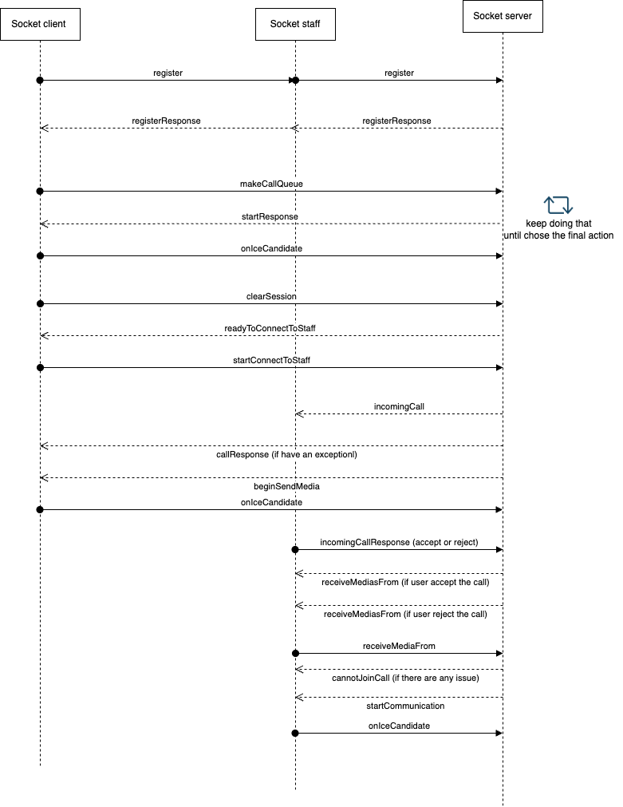

# Call Queue

Here is the call queuing sequence diagram:

Database schema:

1. ServiceHierarchy: the table to store the service config
    1. Schema: please help to check the model file here: [ServiceHierarchy.ts](..%2Fsignaling-service%2Fsrc%2Fmodel%2FServiceHierarchy.ts)
    2. Field description:
     - name: service name
     - audio_url: url to audio file
     - parent_id: the parent service (leave empty if there is no parent service)
     - type: the service type (process_call, busy_call, root)
     - created_date: created date
2. UserChosenService: the table to store the staff who serve the services:
   1. Schema: please help to check the model file: [UserChosenService.ts](..%2Fsignaling-service%2Fsrc%2Fmodel%2FUserChosenService.ts)
   2. Field description:
   - user_name: the staff user name
   - services: the list of service that staff will serve
   - created_date: created date