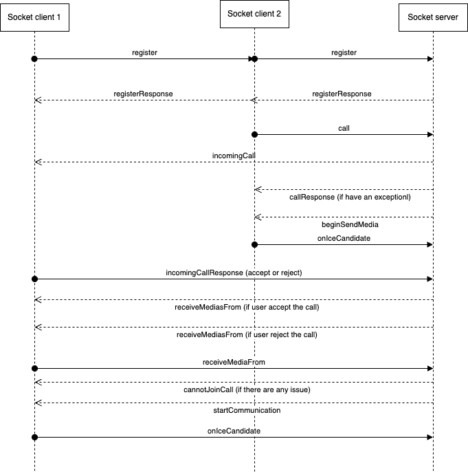
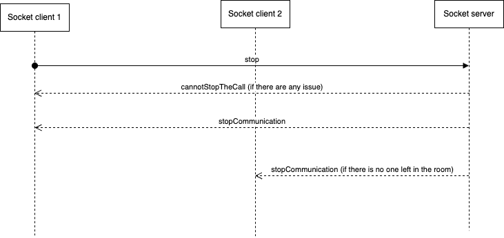
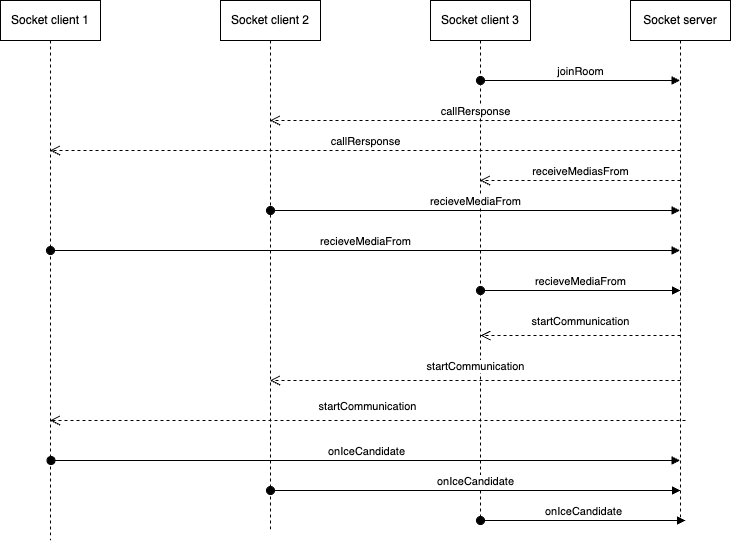

# Call/Group call

1. Call/Group call sequence diagram:
This is the sequence diagram when client 2 try to call to client 2 (the same for group call):

2. Stop the call: 
The client 1 in the call with client 2. Here is the diagram when client 1 stop the call:

3. Join the room:
The client 3 want to join the meeting is happening. Here is the diagram:

